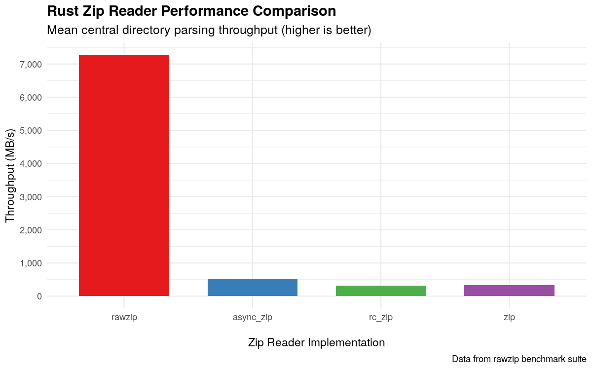

# Rawzip

A low-level Zip archive reader and writer. Pure Rust. Zero dependencies. Zero unsafe. Fast.

## Use Cases

In its current state, rawzip should not be considered a general purpose Zip library like [zip](https://crates.io/crates/zip), [rc-zip](https://crates.io/crates/rc-zip), or [async_zip](https://crates.io/crates/async-zip). Instead, it was born out of a need for the following:

- **Efficiency**: Only pay for what you use. Rawzip does not materialize the central directory when a Zip archive is parsed, and instead provides a lending iterator through the listed Zip entries. For a Zip file with 200k entries, this results in up to 2 orders of magnitude performance increase, as other Zip libraries need 200k+ allocations to rawzip's 0. If storage of all entries is needed for further processing, callers are able to amortize allocations for arbitrary length fields like file names.

- **Bring your own dependencies**: Rawzip pushes the compression responsibility onto the caller. Rust has a myriad of high quality compression libraries to choose from. For instance, just deflate has a half dozen implementations ([#1](https://crates.io/crates/libdeflater), [#2](https://crates.io/crates/miniz_oxide), [#3](https://crates.io/crates/zune-inflate), [#4](https://crates.io/crates/libz-ng-sys), [#5](https://crates.io/crates/zlib-rs), [#6](https://crates.io/crates/cloudflare-zlib-sys)). This allows Rawzip to reach maturity easier and be passively maintained while letting downstream users pick the exact compressor best suited to their needs. The Zip file specification does not change frequently, and the hope is this library won't either.

## Features:

- Pure Rust. Zero dependencies. Zero unsafe. Fast.
- Read and write Zip and Zip64 files
- Facilitates concurrent streaming decompression
- Zero allocation and zero copy when reading from a byte slice

## Example

```rust
use std::io::Read;

// Let's create a Zip archive with a single file, "file.txt", containing the text "Hello, world!"
// and read it back out.
let data = b"Hello, world!";

// Create a new Zip archive in memory.
let mut output = Vec::new();
let mut archive = rawzip::ZipArchiveWriter::new(&mut output);

// Start of a new file in our zip archive with deflate compression.
let mut file = archive.new_file("file.txt")
    .compression_method(rawzip::CompressionMethod::Deflate)
    .create()?;

// Wrap the file in a deflate compressor.
let mut encoder = flate2::write::DeflateEncoder::new(&mut file, flate2::Compression::default());

// Wrap the compressor in a data writer, which will track information for the
// Zip data descriptor (like uncompressed size and crc).
let mut writer = rawzip::ZipDataWriter::new(encoder);

// Copy the data to the writer.
std::io::copy(&mut &data[..], &mut writer)?;

// Finish the file, which will return the finalized data descriptor
let (_, descriptor) = writer.finish()?;

// Write out the data descriptor and return the number of bytes the data compressed to.
let compressed = file.finish(descriptor)?;

// Finish the archive, which will write the central directory.
archive.finish()?;

// Now it is time to read back what we've written! Here we are reading from
// a slice, but there's another set of API that take advantage of reading from a file.
let archive = rawzip::ZipArchive::from_slice(&output)?;

// Rawzip does not materialize the central directory when a Zip archive is parsed,
// so we need to iterate over the entries to find the one we want.
let mut entries = archive.entries();

// Get the first (and only) entry in the archive.
let entry = entries.next_entry()?.unwrap();

// While we can access the raw bytes of the file name, let's use the normalized path
// for demonstration purposes.
assert_eq!(entry.file_path().try_normalize()?.as_ref(), "file.txt");

// Assert the compression method.
assert_eq!(entry.compression_method(), rawzip::CompressionMethod::Deflate);

// Assert the uncompressed size hint. Be warned that this may not be the actual,
// uncompressed size for malicious or corrupted files.
assert_eq!(entry.uncompressed_size_hint(), data.len() as u64);

// Before we need to access the entry's data, we need to know where it is in the archive.
let wayfinder = entry.wayfinder();

let local_entry = archive.get_entry(wayfinder)?;

let mut actual = Vec::new();
let decompressor = flate2::bufread::DeflateDecoder::new(local_entry.data());

// We wrap the decompressor in a verifying reader, which will verify the size and CRC of
// the decompressed data once finished.
let mut reader = local_entry.verifying_reader(decompressor);
std::io::copy(&mut reader, &mut actual)?;

// Assert the data is what we wrote.
assert_eq!(&data[..], actual);
Ok::<(), Box<dyn std::error::Error>>(())
```

## Security

Zip files have a checkered past with maliciously crafted zips causing major headaches.

By virtue of rawzip being a minimal library, several mitigations become the responsibility of the consuming application.

What rawzip provides:

- Memory safety
- Structural validation of EOCD, central directory, and local file headers
- An opt-in file path normalization to protect against zip slips
- An opt-in CRC and size verification of inflated data

What consumers must handle:

- Zip bombs by implementing max compression ratios, max file sizes, and checks for overlapping file data
- Symlink attacks with safe file system operations
- Zip quines and potentially infinite recursion by limiting the amount of nesting

## Benchmarks



If you want to rip through zips as fast as possible, rawzip is for you. Doesn't matter if the zips are 100 GB+ with 200k entries, nothing will be faster.

Reproduce the benchmarks with the following command:

```bash
(cd compare && cargo clean && cargo bench)
find ./compare/target -path "*parse*" -wholename "*/new/raw.csv" -print0 | xargs -0 xsv cat rows > assets/rawzip-benchmark-data.csv
```

The data can be analyzed with the R script found in the assets directory. Keep in mind, benchmarks will vary by machine.
